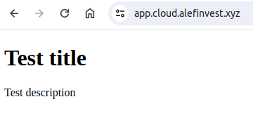

# NextJs app to be deployed via cloudron

## Pre-Requirements

### Working directus backend app

* Having installed directus app with collection `global` (Treat as single object) with fields `title` and `description`.

* The directus backend app URL is pointed in file `/lib/directus.js` and it needs to be changed accordingly to your directus backend app URL.

[READ MORE about building nextjs App for directus](https://docs.directus.io/guides/headless-cms/build-static-website/next.html)

### Cloudron CLI

Cloudron CLI is a command line tool used for building and installing custom apps for Cloudron. You can install the CLI tool on your PC/Mac as follows:
`$ sudo npm install -g cloudron`

You can login to your Cloudron now:

```$ cloudron login my.example.com
Enter credentials for my.example.com:
Username: girish
Password:
Login successful.
```

`cloudron --help` provides a list of all the available commands. See [CLI docs](https://docs.cloudron.io/custom-apps/cli/) for a quick overview.

### Docker

Docker is used for building application images. You can install it from [here](https://docs.docker.com/install/)

### Build

Clone this repository

Adjust url in `/lib/directus.js` to fetch data from your directus backend app URL
```
const directus = createDirectus('https://your-directus-backend-app-url').with(
  rest({
    onRequest: (options) => ({ ...options, cache: 'no-store' }),
  })
);
```

The next step is to build the docker image and push the image to a repository.
```
# enter app directory
$ cd nodejs-app

# build the app
$ docker build -t username/nodejs-app:1.0.0 .

# login to docker registry
$ docker login

# push the image. if the push fails, you have to 'docker login' with your username
$ docker push username/nodejs-app:1.0.0
```

### Install

If you use the public docker registry, Cloudron can pull the app image that you built with no authentication. If you use a private registry, Cloudron has to be configured with the private registry credentials. You can do this in the `Settings` view of Cloudron.

We are now ready to install the app on Cloudron.
```
# be sure to be in the app directory
$ cd tutorial-nodejs-app

$ cloudron install --image username/nodejs-app:1.0.0
Location: app.example.com
App is being installed.

 => Starting ...
 => Registering subdomains
 => Downloading image ....
 => Setting up collectd profile

App is installed.
```
> Private registry
> If you are using a private registry for your image, first configure Cloudron with the private registry credentials. Then, prefix the registry to --image. E.g cloudron install --image docker.io/username/nodejs-app:1.0.0.

Open the app in your default browser:
`$ cloudron open`
You should see `global` collection single item be rendered on your browser.



[READ MORE in the Cloudron Tutorial](https://docs.cloudron.io/packaging/tutorial/)


# NextJs README
This is a [Next.js](https://nextjs.org/) project bootstrapped with [`create-next-app`](https://github.com/vercel/next.js/tree/canary/packages/create-next-app).

## Getting Started

First, run the development server:

```bash
npm run dev
# or
yarn dev
# or
pnpm dev
# or
bun dev
```

Open [http://localhost:3000](http://localhost:3000) with your browser to see the result.

You can start editing the page by modifying `app/page.js`. The page auto-updates as you edit the file.

This project uses [`next/font`](https://nextjs.org/docs/basic-features/font-optimization) to automatically optimize and load Inter, a custom Google Font.

## Learn More

To learn more about Next.js, take a look at the following resources:

- [Next.js Documentation](https://nextjs.org/docs) - learn about Next.js features and API.
- [Learn Next.js](https://nextjs.org/learn) - an interactive Next.js tutorial.

You can check out [the Next.js GitHub repository](https://github.com/vercel/next.js/) - your feedback and contributions are welcome!

## Deploy on Vercel

The easiest way to deploy your Next.js app is to use the [Vercel Platform](https://vercel.com/new?utm_medium=default-template&filter=next.js&utm_source=create-next-app&utm_campaign=create-next-app-readme) from the creators of Next.js.

Check out our [Next.js deployment documentation](https://nextjs.org/docs/deployment) for more details.
